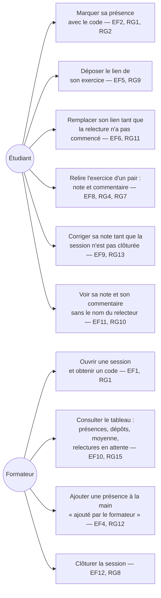

# D1 — Cas d'utilisation

Acteurs tels que définis en section 2 du cahier des charges : le **Relecteur** n'est pas un acteur distinct (hypothèse H2), c'est un étudiant assigné. Les renvois `EFx`/`RGx` correspondent au cahier des charges.

Lecture : le relecteur est un **étudiant dans l'état assigné** (hypothèse H2, section 7) — il n'apparaît donc pas comme un acteur séparé. Le formateur ne marque jamais sa propre présence et ne modifie jamais une note (section 2).
