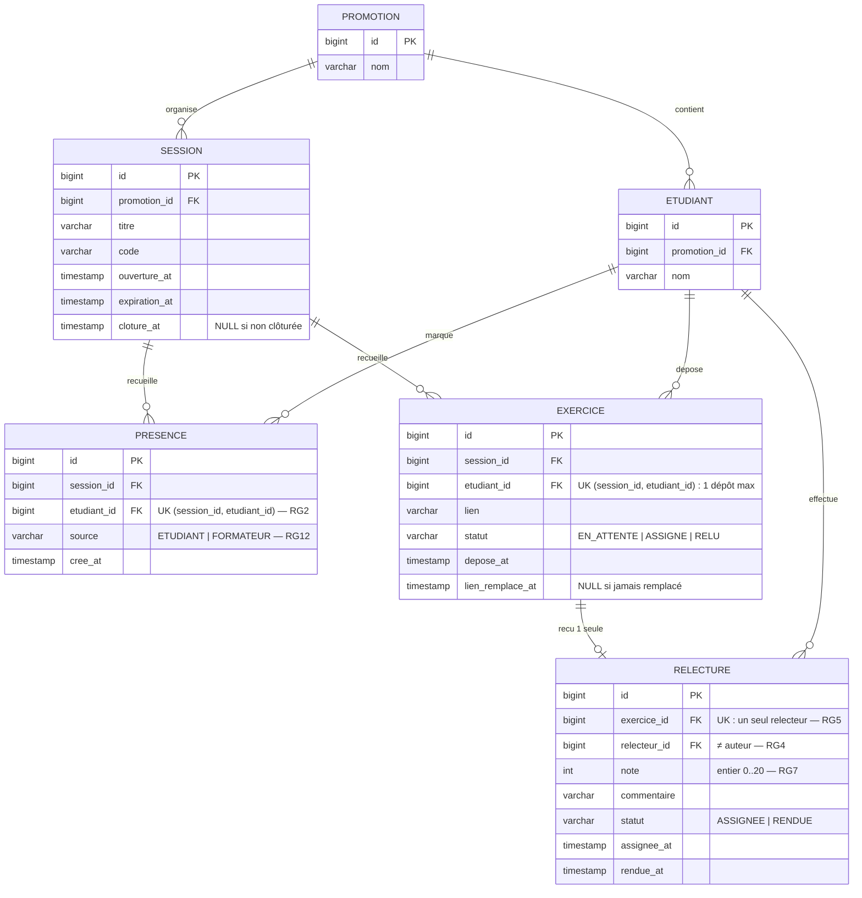

# D2 — Modèle de données

Entités, attributs et cardinalités qui devront correspondre **exactement** aux migrations Flyway de l'étape 2. Le relecteur n'est pas une table (hypothèse H2) : `RELECTURE` relie deux étudiants via un exercice.

Choisis structurants :
- **RG2** (unicité de présence) et **un dépôt par session** sont tenus par des contraintes d'unicité SQL, pas seulement par le code applicatif (ENF3).
- **RG5** (un seul relecteur) : contrainte d'unicité sur `relecture.exercice_id`.
- **RG4** (pas d'auto-relecture) : vérifiée au service, traduite en `403 AUTO_RELECTURE` (contrat).
- Le **statut de l'exercice** (D4) est dérivé de `relecture.statut` : `EN_ATTENTE` → `ASSIGNE` (relecteur désigné) → `RELU` (note rendue).
- La **moyenne** (RG15) n'est stockée nulle part : elle est calculée par l'API dans `GET /api/tableau` (F3 du sujet).
