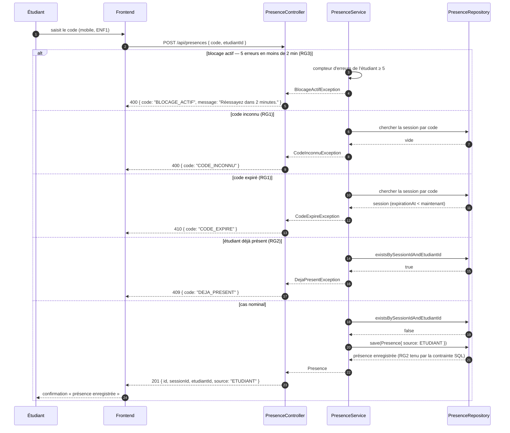

# D3 — Séquence : « marquer sa présence »

Cas nominal et erreurs, codes HTTP strictement identiques à `api/contrat.yaml` (`POST /api/presences`) : `201` / `400 CODE_INCONNU` / `409 DEJA_PRESENT` / `410 CODE_EXPIRE`. Règles citées : RG1 (expiration 15 min), RG2 (unicité), RG3 (blocage 5 erreurs / 2 min).

Chaque branche d'erreur est gérée par le `@RestControllerAdvice` (B4) : le format d'erreur imposé `{ code, message }` est le même partout, aucune stack trace ne sort. Le cas « session clôturée » n'apparaît pas ici : une session clôturée a nécessairement son code expiré (RG1) — l'erreur renvoyée est donc `CODE_EXPIRE`.
