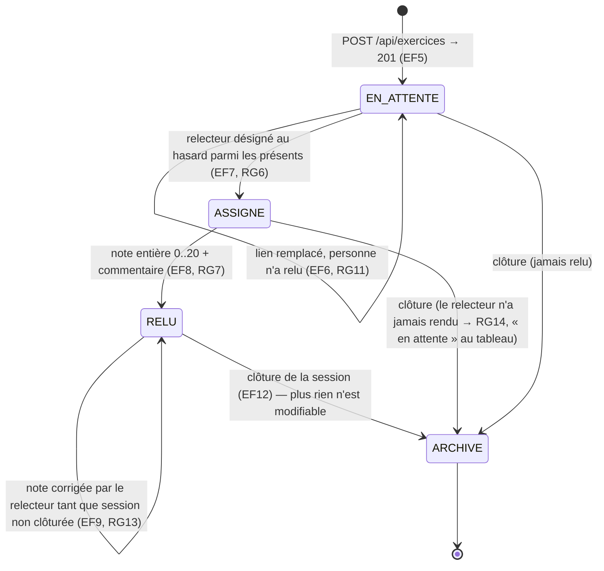

# D4 (bonus) — États-transitions du cycle de vie d'un exercice

Cycle imposé par le sujet : déposé → en attente de relecture → relu. Complété par l'état `ASSIGNE` (EF7 : relecteur désigné) et par les refus de transition, cohérents avec le cahier des charges (RG11, RG13, RG14).

Notes :
- **Sans relecteur possible** (un seul présent = l'auteur, RG4) : l'exercice reste `EN_ATTENTE`, sans relecteur désigné — cas H1 de la section 7. Il ressort dans le tableau comme « relectures en attente » (RG14).
- **Remplacement de lien** (EF6, RG11) : autorisé depuis `EN_ATTENTE`, refusé dès `ASSIGNE`/`RELU` (le remplacement en `ASSIGNE` n'existe pas : dès qu'un relecteur est désigné, la relecture a « commencé » au sens de Q13).
- **Correction de note** (EF9, RG13) : boucle sur `RELU` jusqu'à la clôture ; après clôture, `ARCHIVE` fige tout.
- La relecture non rendue au moment de la clôture reste visible « en attente » dans le tableau (RG14, Q11).
